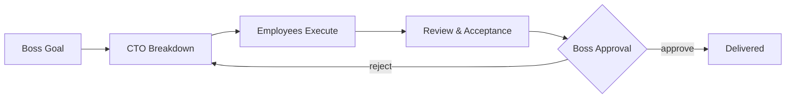

<div align="center">

# 🏢 OPC Company

**Watch your AI coding agents run a company — a 2D office on your Mac, where a CTO agent breaks down your goals and AI employees ship the work in real terminals.**

[](LICENSE)
[](#quick-start)
[](https://github.com/B1ueMu3ic4m/OPCCompany/actions/workflows/ci.yml)
[](#quick-start)
[](#language)

[English](#features) · [中文说明](README.zh-CN.md)

<!-- Demo GIF: rendered offscreen by `swift run OPCDemoGif` from the
shipping render code (OPCDemoStudio) — the same pixels the app draws. -->


*Every employee state is a signal: thinking · typing · coding · blocked · **waiting for your approval** · shipped. All 100% local.*

</div>

---

## Why

AI coding agents are powerful but **invisible**. You fire off tasks into terminals, and then you wait — without knowing who is doing what, what is blocked, or what needs your call.

**OPC Company turns your AI workflow into a company you can watch.** You are the boss. A CTO agent turns your one-line goal into a task graph. Specialist employees — product architect, UI designer, code engineer, reviewer, tester — execute in real terminals (Claude Code, Codex, Gemini CLI, or API models) inside a living 2D office. When something risky happens, it stops and asks you.

Not a chat wrapper. Not a dashboard. A **company metaphor with real authority boundaries**: the boss decides, the CTO dispatches, employees execute, the system safeguards.

## Why OPC Company (vs the others in this space)

The "pixel office / AI workforce" space has a few open-source neighbors. They are genuinely good at *different shapes* of the same idea — here is an honest map so you can pick the right one fast:

| | **OPC Company** | Session viewers (e.g. pixel-agents) | Docker-stack orchestrators (e.g. roboco) |
|---|---|---|---|
| What it is | A **company**: goals → CTO task graph → employees → approvals → deliveries, drawn as a living 2D office | Your agent terminals, animated as pixel characters | An enterprise-style org platform with agent cells |
| Runs | Native macOS app · Windows shell · headless `opc` CLI — `brew install` one line | VS Code panel / `npx` browser tab | Docker + Postgres + Redis + web panel on :3000 |
| Agents | Claude Code / Codex / Gemini CLI, per-employee backends | Claude Code today (others on roadmap) | Multiple CLIs via official binaries |
| Boss authority | Approval gates, per-employee permissions, delivery acceptance — **you decide from the terminal or the GUI** | Watch + permission bubbles | Full org workflow (heavier setup) |
| Install-to-first-employee | ~1 minute, zero servers | marketplace install (editor required) | `make quickstart` + compose stack |

If you want to *watch* one Claude Code session play as pixel characters inside your editor, the viewers are delightful. If you want a **self-contained company that takes orders and ships work** — with you as the boss, on your machine, no infrastructure — that is exactly the niche OPC Company is built for. (And the GIF above is rendered by the app's own code — `swift run OPCDemoGif` — not a mockup.)

## Features

- 🏭 **2D Company Floor (SpriteKit)** — boss office, CTO office, employee hall, ten live character states (idle / thinking / coding / blocked / awaiting approval…)
- 🎯 **CTO Orchestration** — one sentence from you becomes goals → tasks → assignments → aggregated results, with the task graph visible
- 👥 **Real Backends per Employee** — subscription CLIs (Claude Code, Codex, Gemini CLI), API models (OpenAI-compatible, Anthropic, Gemini, DeepSeek, Qwen…), or local placeholders; multiple roles can share one model
- 🛡️ **Approval Gates** — risky actions pause and wait for the boss; permissions are explicit per employee (read/edit files, run commands, network, approve risk)
- 🖥️ **Terminal Hall** — every employee gets a real macOS terminal seat; run one, run all, or preflight dry-runs that cost zero quota
- 📦 **Deliveries & Acceptance** — artifacts, auto-acceptance records, reviewer verdicts, and boss sign-off as a first-class pipeline
- 🧠 **Product Memory** — key decisions, rules, risks and handover notes persist per product
- 💬 **Comms Gateway** — Feishu / WeCom / DingTalk / Telegram channels for phone reports and remote commands
- 🔒 **Local-first** — SQLite-backed history, Keychain for API keys, no cloud dependency for the core loop
- 🌐 **Bilingual UI** — in-app switch between 简体中文 and English
- ⌨️ **Headless CLI (`opc`, v0.2.0)** — status / goal / advance / report from the terminal, driving the same local company snapshot as the GUI
- 🧬 **Embeddable core + Flutter desktop shell (v0.3.0)** — the company engine exports a 6-symbol C ABI; a dart:ffi shell mirrors it on macOS **and Windows** (technical preview), both packaged and launched in CI

## Quick Start

> Requires macOS 14+, and [Swift 6 toolchain](https://www.swift.org/install/) for building.

**Homebrew**:

```bash
brew install --cask B1ueMu3ic4m/tap/opc-company
```

**Build from source:**

```bash
git clone https://github.com/B1ueMu3ic4m/OPCCompany.git
cd OPCCompany
swift build -c release
scripts/build_app_bundle.sh
open dist/OPCCompany.app
```

**First run**

1. Onboarding may keep Gatekeeper quiet for unsigned builds:
   `xattr -cr dist/OPCCompany.app`
2. Click **New Employee** (⌘⇧N) — pick a backend: a CLI you're logged into, or an API model.
3. Type a goal for the CTO in the Command Center. Watch the company work.

## Headless CLI (`opc`)

Since v0.2.0 the same company runs without opening a window — `opc` drives
the exact same local snapshot as the GUI (employees, tasks, approvals stay
in sync both ways):

```bash
swift build -c release --product opc
.build/release/opc status                 # team, task histogram, approvals
.build/release/opc goal "refactor X"      # hand a boss goal to the CTO
.build/release/opc advance                # CTO pushes every open loop one step
.build/release/opc report                 # boss-readable progress report
.build/release/opc approvals              # pending approvals, with their ids
.build/release/opc decide <id> approve    # resolve one — refuses stale/double taps
.build/release/opc products               # list every product workspace (current marked *)
.build/release/opc use <id>               # select a product — same path as the GUI sidebar
.build/release/opc history [n]            # decision ledger: who asked, your verdict, when
.build/release/opc deliverables [n]       # delivery shelf: what was handed over — and whether each file still exists right now
```

`opc` links only the portable core — it's also the first artifact on the
[Windows port](docs/WINDOWS_PORT_RFC.md) path: the logic package has built on
real Windows with zero errors since 2026-09-08, and since v0.2.1 every push
builds **`opc.exe` in CI** (Windows Build workflow → `opc-windows-x86_64`
artifact) with API keys protected by DPAPI. Since v0.3.0 there's also a
cross-platform GUI path — see [the shell](#embeddable-core--flutter-shell-v030).

> Write commands (`goal`, `advance`) refuse to run while the desktop app is
> open — both share one snapshot and last writer wins. Quit the app, or set
> `OPC_ALLOW_CONCURRENT_WRITE=1` if you're sure nothing else writes.

## Embeddable Core + Flutter Shell (v0.3.0)

The company engine (`OPCCompanyCore`) exports a frozen **6-symbol C ABI**
(`include/opc_bridge.h`: create/destroy/lastError/snapshotJson/command/free)
— any language that can `dlopen` can run the whole company. The reference
host is **`flutter_shell/`**, a thin dart:ffi desktop shell: zero business
logic in Dart; the goal bar, approvals queue and task board all mirror the
snapshot JSON the core owns, every button is one bridge verb.

> **Technical preview**: the shell proves the cross-platform path end to end;
> its UI is intentionally minimal, not the SwiftUI experience.

What CI proves on every push:

- `OPCCompanyBridge.dll` builds on Windows and `dumpbin` verifies all six exports
- the Windows shell package is assembled (Flutter SDK pinned to the official release) and **launched in CI** — its 10-check behavioral smoke must print `"ok":true`
- the package is **self-contained**: CI walks the real import closure with `dumpbin /DEPENDENTS` and bundles the Swift/MSVC runtime DLLs beside the exe, then runs the smoke with `PATH` stripped to the system dirs (proving nothing the app needs lives only in the build environment)
- `scripts/build-shell-macos.sh` bundles the bridge dylib into a standalone .app and the packaged app self-checks ALL PASS

Want to try it? Grab `OPCCompanyShell-windows-x64-v<version>.zip` from the
[latest release](https://github.com/B1ueMu3ic4m/OPCCompany/releases) — unpack and run `opc_flutter_shell.exe`
(unsigned preview: Windows may warn on first launch; no installer needed).
Since v0.3.2 the package is self-contained: the Swift/MSVC runtime DLLs
travel inside the zip, no toolchain needed. (v0.3.1 and earlier preview
zips predate the self-containment fix and fail with a missing-DLL error
(0xC0000135) on machines without the Swift 6.3.3 Windows toolchain.)

```bash
cd flutter_shell && flutter run -d macos     # dev loop
bash scripts/ffi-e2e.sh                      # ABI + behavioral smoke, isolated snapshot
```

## The Workflow



- **Boss** — sets goals, approves risks, reads conclusions. Never touches the back office.
- **CTO** — breaks down goals, assigns employees, aggregates results, escalates risks.
- **Employees** — execute in real terminals within explicit permissions; report blockers instead of guessing.
- **System** — checkpoints, session health audits, ghost-job sweeps, evidence archives.

## How It Works

```
Sources/
  OPCCompany/        App entry, menu, language switcher
  OPCCompanyCore/
    CompanyStore.swift     orchestration state machine (11k lines, bilingual zh/en UI)
    CompanyScene.swift     SpriteKit 2D office
    CLIAgentRunner.swift   real-terminal runner for subscription CLIs
    Models.swift           agents, roles, backends, permissions, task graph
    OperationsSuiteView.swift  maintenance: audits, isolation checks, recovery
    ...
Tests/OPCCompanyTests/    611 tests (state machines, security gates, i18n invariants)
```

Deeper docs: [Product Spec](docs/PRODUCT_SPEC.md) · [Agent Roles](docs/AGENT_ROLES.en.md) · [CLI Orchestration](docs/CLI_ORCHESTRATION.en.md) · [Multi-Agent Architecture](docs/MULTI_AGENT_ARCHITECTURE.en.md) · [Runbook](docs/RUNBOOK.en.md)

## Language

The UI ships in 简体中文 and English. Switch anytime: menu bar → **界面语言 / Language** → pick one. Choose *Auto* to follow the system.

## Roadmap

- [ ] Developer ID signing & notarization (drop the `xattr` step) + MSIX for the Windows shell
- [x] ~~Windows companion~~ — shipped v0.3.0: `opc.exe` + Flutter shell package, both built & run in CI
- [ ] Flutter shell → feature parity with the SwiftUI app (its UI is a preview)
- [ ] Linux companion (core already compiles portable-first; needs a CI matrix row)
- [ ] MCP tool marketplace per employee
- [ ] Replay & time-travel debugging for the task graph

## Contributing

PRs welcome — see [CONTRIBUTING.md](CONTRIBUTING.md). Good first issues are labeled. Every merged contribution is credited in release notes.

## Security

OPC Company is local-first (no accounts, no telemetry). API keys live in the
macOS Keychain, risky actions require boss approval, and per-employee
permission gates are default-deny. See [SECURITY.md](SECURITY.md) for the full
policy and how to report a vulnerability privately.

## License

[MIT](LICENSE) © 2026 B1ueMu3ic4m

---

<div align="center">

**Found this useful? A ⭐ helps other AI-coding folks discover it.**

</div>

