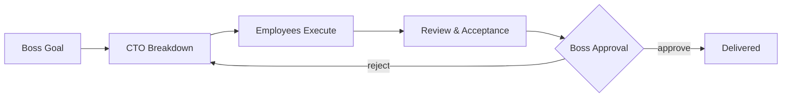

<div align="center">

# 🏢 OPC Company

**Watch your AI coding agents run a company — a 2D office on your Mac, where a CTO agent breaks down your goals and AI employees ship the work in real terminals.**

[](LICENSE)
[](#quick-start)
[](#quick-start)
[](#language)

[English](#features) · [中文说明](README.zh-CN.md)


</div>

---

## Why

AI coding agents are powerful but **invisible**. You fire off tasks into terminals, and then you wait — without knowing who is doing what, what is blocked, or what needs your call.

**OPC Company turns your AI workflow into a company you can watch.** You are the boss. A CTO agent turns your one-line goal into a task graph. Specialist employees — product architect, UI designer, code engineer, reviewer, tester — execute in real terminals (Claude Code, Codex, Gemini CLI, or API models) inside a living 2D office. When something risky happens, it stops and asks you.

Not a chat wrapper. Not a dashboard. A **company metaphor with real authority boundaries**: the boss decides, the CTO dispatches, employees execute, the system safeguards.

## Features

- 🏭 **2D Company Floor (SpriteKit)** — boss office, CTO office, employee hall, ten live character states (idle / thinking / coding / blocked / awaiting approval…)
- 🎯 **CTO Orchestration** — one sentence from you becomes goals → tasks → assignments → aggregated results, with the task graph visible
- 👥 **Real Backends per Employee** — subscription CLIs (Claude Code, Codex, Gemini CLI), API models (OpenAI-compatible, Anthropic, Gemini, DeepSeek, Qwen…), or local placeholders; multiple roles can share one model
- 🛡️ **Approval Gates** — risky actions pause and wait for the boss; permissions are explicit per employee (read/edit files, run commands, network, approve risk)
- 🖥️ **Terminal Hall** — every employee gets a real macOS terminal seat; run one, run all, or preflight dry-runs that cost zero quota
- 📦 **Deliveries & Acceptance** — artifacts, auto-acceptance records, reviewer verdicts, and boss sign-off as a first-class pipeline
- 🧠 **Product Memory** — key decisions, rules, risks and handover notes persist per product
- 💬 **Comms Gateway** — Feishu / WeCom / DingTalk / Telegram channels for phone reports and remote commands
- 🔒 **Local-first** — SQLite-backed history, Keychain for API keys, no cloud dependency for the core loop
- 🌐 **Bilingual UI** — in-app switch between 简体中文 and English

## Quick Start

> Requires macOS 14+, and [Swift 6 toolchain](https://www.swift.org/install/) for building.

**Homebrew**:

```bash
brew install --cask B1ueMu3ic4m/tap/opc-company
```

**Build from source:**

```bash
git clone https://github.com/B1ueMu3ic4m/OPCCompany.git
cd OPCCompany
swift build -c release
scripts/build_app_bundle.sh
open dist/OPCCompany.app
```

**First run**

1. Onboarding may keep Gatekeeper quiet for unsigned builds:
   `xattr -cr dist/OPCCompany.app`
2. Click **New Employee** (⌘⇧N) — pick a backend: a CLI you're logged into, or an API model.
3. Type a goal for the CTO in the Command Center. Watch the company work.

## The Workflow



- **Boss** — sets goals, approves risks, reads conclusions. Never touches the back office.
- **CTO** — breaks down goals, assigns employees, aggregates results, escalates risks.
- **Employees** — execute in real terminals within explicit permissions; report blockers instead of guessing.
- **System** — checkpoints, session health audits, ghost-job sweeps, evidence archives.

## How It Works

```
Sources/
  OPCCompany/        App entry, menu, language switcher
  OPCCompanyCore/
    CompanyStore.swift     orchestration state machine (11k lines, 1.9k i18n strings)
    CompanyScene.swift     SpriteKit 2D office
    CLIAgentRunner.swift   real-terminal runner for subscription CLIs
    Models.swift           agents, roles, backends, permissions, task graph
    OperationsSuiteView.swift  maintenance: audits, isolation checks, recovery
    ...
Tests/OPCCompanyTests/    568 tests (state machines, security gates, i18n invariants)
```

Deeper docs: [Product Spec](docs/PRODUCT_SPEC.md) · [Agent Roles](docs/AGENT_ROLES.en.md) · [CLI Orchestration](docs/CLI_ORCHESTRATION.en.md) · [Multi-Agent Architecture](docs/MULTI_AGENT_ARCHITECTURE.en.md) · [Runbook](docs/RUNBOOK.en.md)

## Language

The UI ships in 简体中文 and English. Switch anytime: menu bar → **界面语言 / Language** → pick one. Choose *Auto* to follow the system.

## Roadmap

- [ ] Developer ID signing & notarization (drop the `xattr` step)
- [ ] Windows/Linux companion for cross-platform teams
- [ ] MCP tool marketplace per employee
- [ ] Replay & time-travel debugging for the task graph

## Contributing

PRs welcome — see [CONTRIBUTING.md](CONTRIBUTING.md). Good first issues are labeled. Every merged contribution is credited in release notes.

## License

[MIT](LICENSE) © 2026 B1ueMu3ic4m
