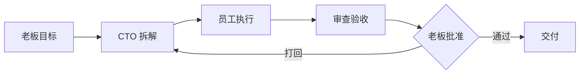

<div align="center">

# 🏢 OPC 公司

**把你的 AI 编程智能体变成一家看得见的公司 —— Mac 上的 2D 办公室:CTO 智能体拆解你的目标,AI 员工在真实终端里干活。**

[](LICENSE)
[](#快速开始)
[](https://github.com/B1ueMu3ic4m/OPCCompany/actions/workflows/ci.yml)
[](#快速开始)

[English](README.md) · [中文说明](#产品定位)

</div>

---

## 产品定位

AI 编程智能体很强大,但是**看不见**。任务丢进终端,然后就是干等——不知道谁在做什么、什么被卡住、什么需要你拍板。

**OPC 公司把你的 AI 工作流变成一家可以围观的公司。** 你是老板。CTO 智能体把一句话目标拆成任务图;产品架构师、界面设计师、代码工程师、审查员、测试工程师等员工,在真实终端(Claude Code、Codex、Gemini CLI 或接口模型)里执行工作,全部呈现在一个活的 2D 办公室里。出现风险动作时,流程会停下来问你。

这不是聊天壳,也不是仪表盘。这是一套**有真实权限边界的公司隐喻**:老板决策、CTO 调度、员工执行、系统保障。

## 功能

- 🏭 **2D 公司场景(SpriteKit)** —— 老板办公室、CTO 办公室、员工大厅,十种实时角色状态(待命/思考/编码/阻塞/待批准……)
- 🎯 **CTO 编排** —— 一句话 → 目标 → 任务 → 派工 → 结果汇总,任务图全程可见
- 👥 **每个员工接真实后端** —— 订阅制 CLI(Claude Code、Codex、Gemini CLI)、接口模型(OpenAI 兼容、Anthropic、Gemini、DeepSeek、Qwen……)或本地占位;同一模型可扮演多个角色
- 🛡️ **审批门禁** —— 风险动作暂停等老板;每个员工的权限显式声明(读/写文件、执行命令、联网、批准风险)
- 🖥️ **终端大厅** —— 每个员工一个真实 macOS 终端席位;单开、全开,或零额度干跑预检
- 📦 **交付与验收** —— 产物、自动验收记录、审查结论、老板签收,一等公民流水线
- 🧠 **产品记忆库** —— 关键决策、规则、风险与交接信息按产品持久化
- 💬 **通信网关** —— 飞书 / 企业微信 / 钉钉 / Telegram 通道,手机收汇报、发指令
- 🔒 **本地优先** —— SQLite 历史索引,钥匙串存密钥,核心链路不依赖云
- 🌐 **中英双语** —— 应用内一键切换 简体中文 / English

## 快速开始

> 需要 macOS 14+,编译需 [Swift 6 工具链](https://www.swift.org/install/)。

**从源码构建:**

```bash
git clone https://github.com/B1ueMu3ic4m/OPCCompany.git
cd OPCCompany
swift build -c release
scripts/build_app_bundle.sh
open dist/OPCCompany.app
```

**首次运行**

1. 未签名构建先解除 Gatekeeper:`xattr -cr dist/OPCCompany.app`
2. 点 **新增员工**(⌘⇧N)——选择后端:你已登录的 CLI,或接口模型。
3. 在总控台给 CTO 输入一句话目标,看公司开工。

完整英文文档见 [README.md](README.md)。

## 工作流



## 参与

欢迎 PR,见 [CONTRIBUTING.md](CONTRIBUTING.md)。

## 许可证

[MIT](LICENSE) © 2026 B1ueMu3ic4m
