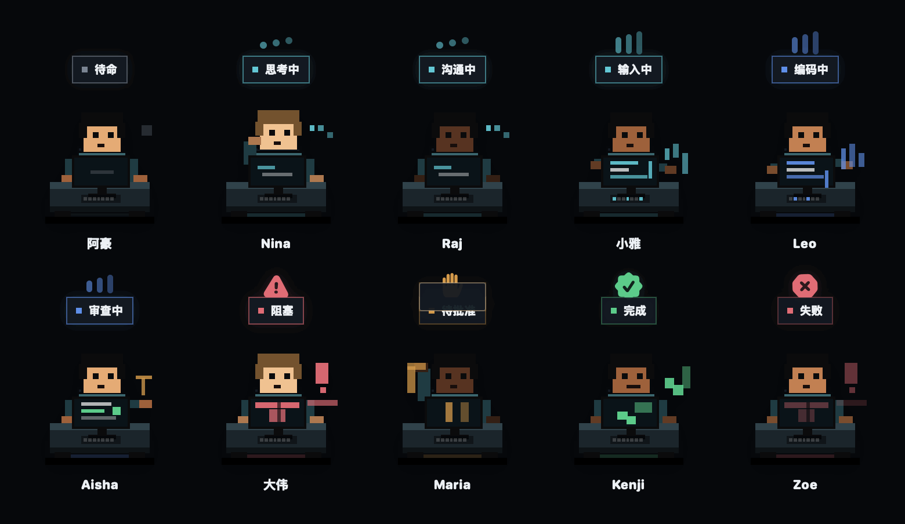
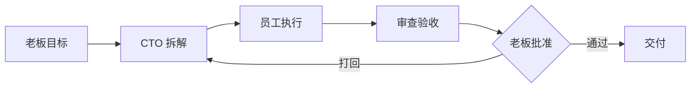

<div align="center">

# 🏢 OPC 公司

**把你的 AI 编程智能体变成一家看得见的公司 —— Mac 上的 2D 办公室:CTO 智能体拆解你的目标,AI 员工在真实终端里干活。**

[](LICENSE)
[](#快速开始)
[](https://github.com/B1ueMu3ic4m/OPCCompany/actions/workflows/ci.yml)
[](#快速开始)

[English](README.md) · [中文说明](#产品定位)



*每个员工状态都是一个信号:思考中 · 打字中 · 编码中 · 被卡住 · **等你批复** · 已交付。全程 100% 本地。*

</div>

---

## 产品定位

AI 编程智能体很强大,但是**看不见**。任务丢进终端,然后就是干等——不知道谁在做什么、什么被卡住、什么需要你拍板。

**OPC 公司把你的 AI 工作流变成一家可以围观的公司。** 你是老板。CTO 智能体把一句话目标拆成任务图;产品架构师、界面设计师、代码工程师、审查员、测试工程师等员工,在真实终端(Claude Code、Codex、Gemini CLI 或接口模型)里执行工作,全部呈现在一个活的 2D 办公室里。出现风险动作时,流程会停下来问你。

这不是聊天壳,也不是仪表盘。这是一套**有真实权限边界的公司隐喻**:老板决策、CTO 调度、员工执行、系统保障。

## 为什么选 OPC 公司(和同赛道的区别)

「像素办公室 / AI 数字员工」这个方向有几个都很不错的开源邻居,它们做的是同一个想法的**不同形态**——给你一张诚实的对照表,帮你快速选对:

| | **OPC 公司** | 会话可视化类(如 pixel-agents) | Docker 全家桶编排类(如 roboco) |
|---|---|---|---|
| 它是什么 | 一家**公司**:目标 → CTO 任务图 → 员工执行 → 审批 → 交付验收,画成一座活的 2D 办公室 | 把你的 agent 终端动画成像素小人 | 企业级组织平台,agent 分小队 |
| 运行形态 | 原生 macOS App · Windows 壳 · 无头 `opc` CLI —— `brew install` 一行 | VS Code 面板 / `npx` 浏览器页 | Docker + Postgres + Redis + 网页面板 :3000 |
| Agent | Claude Code / Codex / Gemini CLI,每人独立后端 | 目前主要是 Claude Code(其余在路线图) | 多个官方 CLI |
| 老板权力 | 审批门、员工权限、交付验收——**终端或界面里都能拍板** | 观看 + 权限气泡 | 完整组织流程(部署更重) |
| 从零到第一位员工 | 约 1 分钟,零服务器 | 装扩展(依赖编辑器) | `make quickstart` + compose 栈 |

想「围观一个 Claude Code 会话变成编辑器里的小人」,可视化类很讨喜。要的是一支**能接订单、能交活、自包含的公司**——你是老板、跑在你机器上、不养基础设施——那正是 OPC 公司为它而生的形态。(上面那张 GIF 由应用自己的渲染代码离线生成:`swift run OPCDemoGif`,不是假图。)

## 功能

- 🏭 **2D 公司场景(SpriteKit)** —— 老板办公室、CTO 办公室、员工大厅,十种实时角色状态(待命/思考/编码/阻塞/待批准……)
- 🎯 **CTO 编排** —— 一句话 → 目标 → 任务 → 派工 → 结果汇总,任务图全程可见
- 👥 **每个员工接真实后端** —— 订阅制 CLI(Claude Code、Codex、Gemini CLI)、接口模型(OpenAI 兼容、Anthropic、Gemini、DeepSeek、Qwen……)或本地占位;同一模型可扮演多个角色
- 🛡️ **审批门禁** —— 风险动作暂停等老板;每个员工的权限显式声明(读/写文件、执行命令、联网、批准风险)
- 🖥️ **终端大厅** —— 每个员工一个真实 macOS 终端席位;单开、全开,或零额度干跑预检
- 📦 **交付与验收** —— 产物、自动验收记录、审查结论、老板签收,一等公民流水线
- 🧠 **产品记忆库** —— 关键决策、规则、风险与交接信息按产品持久化
- 💬 **通信网关** —— 飞书 / 企业微信 / 钉钉 / Telegram 通道,手机收汇报、发指令
- 🔒 **本地优先** —— SQLite 历史索引,钥匙串存密钥,核心链路不依赖云
- 🌐 **中英双语** —— 应用内一键切换 简体中文 / English
- ⌨️ **无头 CLI(`opc`,v0.2.0)** —— 终端里 status / goal / advance / report,与 GUI 共用同一份本司快照
- 🧬 **可嵌入核心 + Flutter 桌面壳(v0.3.0)** —— 公司引擎导出 6 符号 C ABI;dart:ffi 薄壳在 macOS **与 Windows** 镜像同一家公司(技术预览),两端包均在 CI 构建并真实启动验证

## 快速开始

> 需要 macOS 14+,编译需 [Swift 6 工具链](https://www.swift.org/install/)。

**从源码构建:**

```bash
git clone https://github.com/B1ueMu3ic4m/OPCCompany.git
cd OPCCompany
swift build -c release
scripts/build_app_bundle.sh
open dist/OPCCompany.app
```

**首次运行**

1. 未签名构建先解除 Gatekeeper:`xattr -cr dist/OPCCompany.app`
2. 点 **新增员工**(⌘⇧N)——选择后端:你已登录的 CLI,或接口模型。
3. 在总控台给 CTO 输入一句话目标,看公司开工。

## 无头 CLI(`opc`,v0.2.0)

不开窗口也能运营公司——`opc` 读写的就是 GUI 用的同一份本地快照(员工、任务、审批双向同步):

```bash
swift build -c release --product opc
.build/release/opc status                 # 团队、任务分布、待批
.build/release/opc goal "重构 X 模块"      # 把老板目标交给 CTO
.build/release/opc advance                # CTO 推进所有在途目标一步
.build/release/opc report                 # 老板视角进度报告
.build/release/opc approvals              # 待批审批,带各自 id
.build/release/opc decide <id> approve    # 批复一条——过期/双击会被明确拒绝
.build/release/opc products               # 列出全部产品工作区(当前项带 * 标记)
.build/release/opc use <id>               # 切换选中产品——与 GUI 侧栏同一条路径
.build/release/opc history [n]            # 决策台账——谁在问、你的批复、何时(纯读)
```

`opc` 只链接可移植核心层——它也是 Windows 移植路径上的第一个产物:逻辑层自
2026-09-08 起在真实 Windows 上零错误编译;v0.2.1 起每次 push 都在 CI 里构建
**`opc.exe`**(Windows Build workflow → `opc-windows-x86_64` artifact),
API 密钥由 DPAPI 加密保护。v0.3.0 起 GUI 也有跨平台路径——见下文 Flutter 壳。

> 写命令(`goal`、`advance`)在桌面 App 打开时会被拒绝——两者共用同一份快照,后写者胜。
> 先退出 App,或确认无其他写入方时设 `OPC_ALLOW_CONCURRENT_WRITE=1`。

## 可嵌入核心 + Flutter 壳(v0.3.0)

公司引擎(`OPCCompanyCore`)导出冻结的 **6 符号 C ABI**(`include/opc_bridge.h`:
create/destroy/lastError/snapshotJson/command/free)——任何能 `dlopen` 的语言
都能运行整家公司。参考宿主是 **`flutter_shell/`**:一个 dart:ffi 薄壳,Dart
侧零业务逻辑;目标栏、审批队列、任务板全部镜像核心持有的快照 JSON,每个按钮
就是一次桥动词调用。

> **技术预览**:壳端到端证明了跨平台路径;它的 UI 有意保持最简,不是 SwiftUI 的体验。

每次 push CI 证明的事:

- `OPCCompanyBridge.dll` 在 Windows 构建成功,`dumpbin` 验证全部 6 个导出符号
- Windows 壳包被组装(Flutter SDK 钉官方版本)并**在 CI 里真实启动**——10 项行为冒烟必须输出 `"ok":true`
- 壳包**自包含**:CI 用 `dumpbin /DEPENDENTS` 走真实导入闭包,把 Swift/MSVC 运行时 DLL 捆进包里,再以仅剩系统目录的 `PATH` 跑冒烟——证明应用不再依赖构建环境里才有的 DLL
- `scripts/build-shell-macos.sh` 把桥 dylib 捆进独立 .app,打包后的 app 自检全绿才算构建完成

想上手?到 [最新 Release](https://github.com/B1ueMu3ic4m/OPCCompany/releases) 下载
`OPCCompanyShell-windows-x64-v<版本号>.zip`,解压即运行 `opc_flutter_shell.exe`
(未签名预览版,首次启动 Windows 可能提示;无需安装器)。
自 v0.3.2 起安装包已自包含:Swift/MSVC 运行时 DLL 随包分发,无需工具链。
(v0.3.1 及更早的预览包打包于该修复之前,在未装 Swift 6.3.3 Windows
工具链的机器上会以缺 DLL(0xC0000135)失败。)

```bash
cd flutter_shell && flutter run -d macos     # 开发循环
bash scripts/ffi-e2e.sh                      # ABI + 行为冒烟,隔离快照
```

完整英文文档见 [README.md](README.md)。

## 工作流



## 参与

欢迎 PR,见 [CONTRIBUTING.md](CONTRIBUTING.md)。

## 安全

OPC 公司是本地优先应用(无账号、无遥测)。API 密钥存于 macOS 钥匙串,高风险动作需老板批准,员工权限默认全关。完整策略与漏洞私密上报方式见 [SECURITY.md](SECURITY.md)。

## 许可证

[MIT](LICENSE) © 2026 B1ueMu3ic4m

---

<div align="center">

**觉得有用?点个 ⭐ 能让更多 AI 编程同好发现它。**

</div>

